# RemoteCode

Control [Claude Code](https://docs.anthropic.com/en/docs/claude-code) remotely through Telegram. Built specifically for Claude Code.

RemoteCode works directly with your local Claude Code -- same sessions, same project context, same history. Pick up where you left off in the terminal, switch projects, or start a new session, all from Telegram.

```
You (Anywhere)  <-->  RemoteCode (Host)  <-->  Claude Code (Host)
```

## Features

- **Text chat** -- Send any message, get Claude Code responses with Markdown formatting
- **Image analysis** -- Send photos or image documents, optionally with a caption prompt
- **Voice messages** -- Transcribed locally via whisper-cli (offline, free), then sent to Claude Code
- **Session management** -- Multiple sessions, switch between them, browse by project
- **Auto-sync** -- Watch active session files and forward new messages in real-time
- **Background daemon** -- Runs as a detached process with log rotation
- **User access control** -- Restrict access by Telegram user ID or username

## Demo

[](https://www.youtube.com/watch?v=JFlsf4MPQB8)

▶ [Watch the demo on YouTube](https://www.youtube.com/watch?v=JFlsf4MPQB8)

## Platform Support

| Platform | Status | Notes |
|---|---|---|
| **macOS** | Supported | Homebrew for STT dependencies |
| **Linux** | Supported | STT currently not supported |
| **Windows** | Not tested | |

## Quick Start

### Prerequisites

- **macOS** or **Linux**
- **Node.js** >= 18
- **Claude Code CLI** installed and authenticated (`claude` command available)
- **Telegram Bot Token** -- create a bot via [@BotFather](https://t.me/BotFather) on Telegram (send `/newbot`, follow the prompts, copy the token). See [Telegram's official guide](https://core.telegram.org/bots/tutorial#obtain-your-bot-token) for details

### Install

```bash
npm install -g @kcisoul/remotecode
```

Or from source:

```bash
git clone https://github.com/kcisoul/remotecode.git
cd remotecode
npm install && npm run build
npm link
```

### First Run

```bash
remotecode
```

The interactive setup wizard will prompt for:

1. **TELEGRAM_BOT_TOKEN** -- validated against Telegram API
2. **REMOTECODE_ALLOWED_USERS** -- comma-separated user IDs or @usernames
3. **REMOTECODE_YOLO** -- `Y` enables autonomous mode (Claude Code runs without permission prompts). Set `N` to get Allow / Deny / Allow all prompts via Telegram inline buttons for each tool action
4. **STT setup** -- optional offline voice transcription. Installs `whisper-cli` and `ffmpeg` via your system's package manager, and downloads a local Whisper model (~466 MB). Runs entirely on your machine -- no API calls, completely free

Config is saved to `~/.remotecode/config`.

## How It Works

```mermaid
sequenceDiagram
    participant U as 📱 Telegram
    participant T as ☁️ Telegram API
    participant D as ⚙️ RemoteCode
    participant C as 🤖 Claude Code

    U->>T: Send message
    T->>D: Long polling (getUpdates)
    D->>D: Auth check & route

    alt Text message
        D->>C: SDK query (prompt)
    else Image
        D->>T: Download file
        D->>C: SDK query (prompt + image path)
    else Voice
        D->>T: Download audio
        D->>D: ffmpeg → whisper-cli transcription
        D->>C: SDK query (transcription)
    end

    C-->>D: Streaming response
    D->>D: Markdown → Telegram HTML
    D->>T: sendMessage (HTML)
    T-->>U: Formatted response
```



## CLI Commands

| Command | Description |
|---|---|
| `remotecode` | Start daemon (or show status if already running) |
| `remotecode start` | Start the background daemon |
| `remotecode stop` | Stop the daemon |
| `remotecode restart` | Restart the daemon |
| `remotecode status` | Show daemon status, active session, uptime |
| `remotecode logs` | Follow logs in real-time (default) |
| `remotecode logs -n 50` | Show last 50 log lines (static) |
| `remotecode logs --level ERROR` | Filter by log level (DEBUG/INFO/WARN/ERROR) |
| `remotecode logs --tag claude` | Filter by component tag |
| `remotecode config` | Edit configuration (auto-restarts daemon) |
| `remotecode setup-stt` | Install whisper-cli, ffmpeg, and download model |

### Flags

| Flag | Description |
|---|---|
| `-v`, `--verbose` | Enable verbose (DEBUG) logging |

## Telegram Commands

Send these as messages in your Telegram chat with the bot:

| Command | Description |
|---|---|
| `/start`, `/help` | Welcome message with quick action buttons |
| `/sessions` | Browse and switch between recent sessions |
| `/projects` | Browse sessions grouped by project directory |
| `/new` | Start a new Claude Code session |
| `/history` | Show conversation history of current session |
| `/cancel` | Cancel the current task |
| `/model` | Switch Claude model (Sonnet / Opus / Haiku) |
| `/sync` | Toggle auto-sync notifications on/off |
| `/<skill>` | Invoke any Claude Code skill (auto-discovered) |

### Claude Code Skills

Any `/command` not recognized as a built-in bot command is automatically forwarded to Claude Code as a skill invocation. RemoteCode discovers skills from:

- **`~/.claude/skills/*/SKILL.md`** -- standalone skills installed in the skills directory
- **Enabled plugins** -- skills bundled with plugins listed in `~/.claude/settings.json` under `enabledPlugins`

Discovered skills are registered as Telegram bot commands on startup, so they appear in Telegram's `/` command menu alongside built-in commands.

**Example:**

```
/last30days AI video tools      → Invokes the last30days skill with "AI video tools"
/mem_search auth implementation → Searches claude-mem memory for "auth implementation"
```

When invoked, the skill's `SKILL.md` content is loaded and injected into the prompt as context, so Claude follows the skill's instructions. If no matching skill file is found, the command is forwarded as a generic skill invocation request.

### Inline Buttons

After `/sessions` or `/projects`, interactive inline keyboards let you:

- **Switch** to any session with one tap (old task continues silently in background)
- **Create** new sessions (globally or per-project)
- **Delete** sessions
- **Navigate** between project views

### Permission Prompts (non-YOLO)

When YOLO mode is off, Claude Code tool actions trigger an inline keyboard:

- **Allow** -- permit this single action
- **Deny** -- reject and interrupt the task
- **Allow all** -- auto-allow all actions for the rest of this session (resets on session switch)

## Message Types

### Text

Send any text message. If it's not a `/command`, it's forwarded to Claude Code as a prompt. Responses are rendered as Telegram HTML with code blocks, bold, italic, and more.

### Images

Send a photo or image document (PNG, JPG, etc.). The bot downloads the image, saves it to a temp directory, and includes the file path in the Claude Code prompt. Add a caption to provide context.

### Voice / Audio

Send a voice message or audio file. The bot:

1. Downloads the audio file
2. Converts to WAV via `ffmpeg`
3. Transcribes via `whisper-cli` (local, offline)
4. Sends the transcription as a prompt to Claude Code
5. Returns both your transcription and Claude's response in a blockquote

> Requires STT setup: `remotecode setup-stt`

## Session Management

RemoteCode discovers sessions from `~/.claude/projects/*/` by scanning `.jsonl` files. Each session maps to a Claude Code conversation.

- **Active session** is stored in `~/.remotecode/local`
- **Session CWD** determines which directory Claude Code runs in
- Sessions are auto-created on first message if none exists
- **Switching sessions** while a task is running keeps the old task working silently in the background -- only the active session's messages are shown. Use `/cancel` to stop a task

### Auto-Sync

When enabled (`/sync`), RemoteCode watches the active session's `.jsonl` file and forwards new messages from Claude Code in real-time. This means if you use Claude Code on your host machine, you'll see the conversation in Telegram too.

The watcher polls for session changes every 3 seconds and uses `fs.watch` for file-level changes with 500ms debouncing.

## Configuration

### Config File

`~/.remotecode/config` -- simple key=value format:

```ini
TELEGRAM_BOT_TOKEN=123456:ABC-DEF
REMOTECODE_ALLOWED_USERS=12345678,@username
REMOTECODE_YOLO=true
```

### Environment Variables

| Variable | Required | Description |
|---|---|---|
| `TELEGRAM_BOT_TOKEN` | Yes | Bot token from @BotFather |
| `REMOTECODE_ALLOWED_USERS` | Yes | Comma/space-separated user IDs or @usernames |
| `REMOTECODE_YOLO` | No | `true` to auto-approve all tool actions. `false` to get Allow / Deny / Allow all prompts via Telegram |
| `REMOTECODE_VERBOSE` | No | `true` to enable DEBUG-level logging |

## Speech-to-Text (STT)

RemoteCode uses [whisper.cpp](https://github.com/ggerganov/whisper.cpp) for local, offline speech-to-text.

### Setup

```bash
remotecode setup-stt
```

This auto-detects your package manager and installs:
- **whisper-cpp** -- C++ inference engine for Whisper
- **ffmpeg** -- audio format conversion
- **ggml-small.bin** -- Whisper small model (~466 MB, downloaded from HuggingFace)

Supported package managers: Homebrew (macOS/Linux), apt (Ubuntu/Debian), dnf (Fedora/RHEL), yum (CentOS), pacman (Arch), apk (Alpine).

### How it works

1. Audio downloaded from Telegram (`.oga` format)
2. Converted to 16kHz mono WAV via `ffmpeg`
3. Transcribed via `whisper-cli -m ggml-small.bin -l auto`
4. Blank audio detection filters out silence/noise
5. Transcription sent to Claude Code as a regular prompt

## Security

- **User allowlist** -- Only configured user IDs and usernames can interact
- **Repeat block** -- Unauthorized users are warned once, then silently blocked
- **No webhook** -- Uses long polling, no public endpoints needed
- **Local STT** -- Voice transcription runs entirely offline via whisper.cpp
- **YOLO mode** -- Enables autonomous mode where all tool actions are auto-approved. When off, each action shows Allow / Deny / Allow all buttons in Telegram. "Allow all" grants session-level auto-approval that resets on session switch

## Development

```bash
# Run in development mode
npm run dev

# Build TypeScript
npm run build

# Run tests
npm test

# Watch tests
npm run test:watch
```

## License

[MIT](LICENSE)
